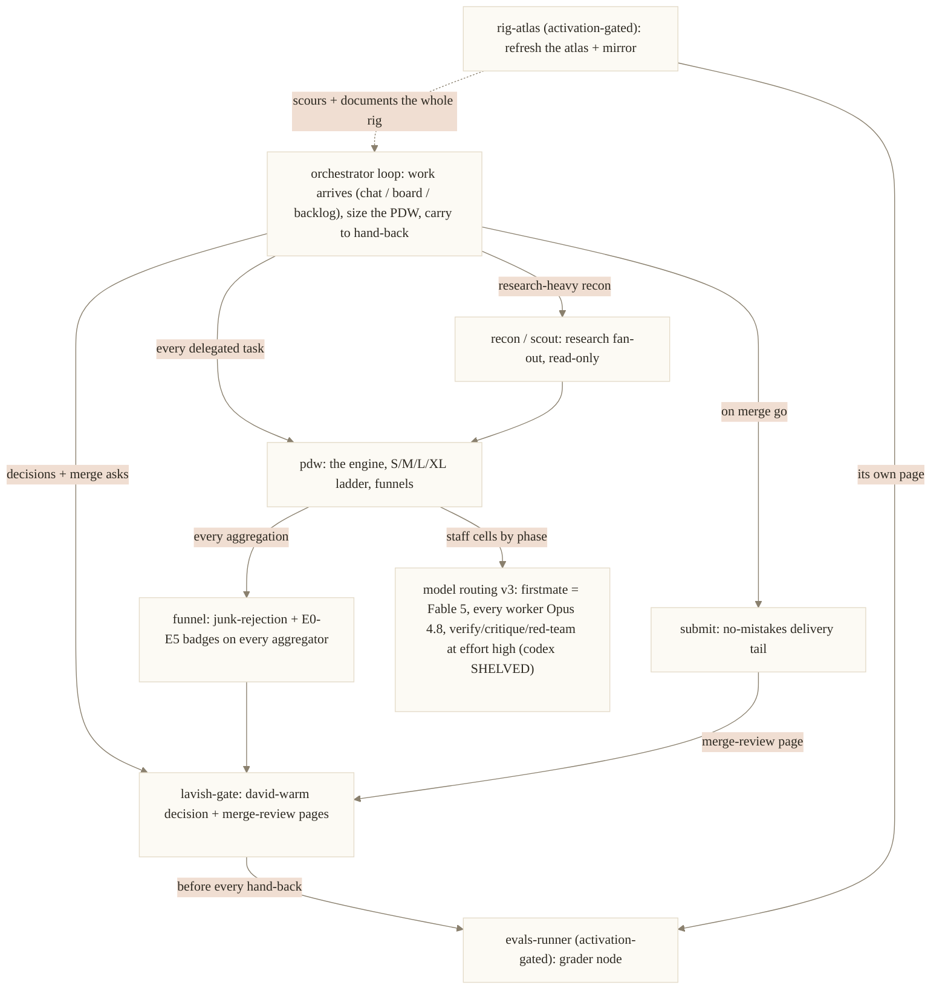

# The firstmate spine

The spine is firstmate's module system: each module is a workflow whose pipeline is written out as explicit nodes, with entry and exit criteria, so the behavior lives in files instead of a session's memory.
It is ported from Jim's captain-workflow system and ADAPTED to firstmate's rig, which is an orchestrator (a fleet of project clones, a board, standing merge grants), not a single-repo captain loop.
The modules are staged here under `.agents/skills-spine/` and are NOT yet symlinked live; this is the reviewable draft of the spine, not the running instruction surface.

> SUBSTRATE PRESENT (as of 2026-07-10, read before anything below). This spine references `data/operating-model/{components/david-warm.html, evidence-ladder.md, funnel-rules.md, evals/*}`. Those files are now on disk, installed untracked-local (like data/backlog.md and data/captain.md) under David's Option C; the AGENTS.md mandate lines that cite them merged in DQ4443/firstmate#26. The substrate stays untracked-local by design, not tracked on `main`. Every module that names one of those paths carries the same banner. The modules are ready to run against the substrate; symlink activation of the spine (wiring these modules into `.agents/skills/`) remains David-gated.

## The shared principle: rules in files, not memory

Every module carries the same portability law.
Firstmate's contract, pins, and pipelines live in tracked files (`AGENTS.md`, `CLAUDE.md`, `data/operating-model/decisions.md`, these skills, the `bin/` scripts), because a long session compacts its prose away (AGENTS.md section 7) and a restart erases its window entirely (section 8).
So every node cites its governing file by path, every workflow return carries a `NEXT_STEP` pin that re-enters the next contract-critical action into context at completion, and any long loop keeps a resumable ledger with a hard-capped canary (section 4).
A rule that fires late must ride a mechanical carrier; prose is never trusted to survive.

## The modules

| Module                              | Purpose                                                                                                                                                                                                                                      | When it fires                                                                                    | Governing pins                                                                                                             |
| ----------------------------------- | -------------------------------------------------------------------------------------------------------------------------------------------------------------------------------------------------------------------------------------------- | ------------------------------------------------------------------------------------------------ | -------------------------------------------------------------------------------------------------------------------------- |
| **build** (Jim's /build round loop) | The OPTIONAL round-loop control surface: intent, entry recon, then checkpoint / plan+TDD / implement / validate rounds to a merge-ready result. NOT the always-on arrival path; that is AGENTS.md sections 2 and 3.                          | Invoked EXPLICITLY on an ambiguous or high-stakes build only; never the default for volume work. | decisions.md deferred list (optional control surface, never the default); AGENTS.md sections 2 and 3 for how work arrives. |
| **pdw**                             | The execution engine: one Workflow-tool call with funnels between stages, sized on the S/M/L/XL tier ladder re-declared per round.                                                                                                           | All delegated work, even a thin one-to-three-agent job.                                          | AGENTS.md section 3 (PDW is the hard default), section 4 (funnels, serialize overlapping writers).                         |
| **recon** (scout)                   | Research fan-out: prior-art, explore, synthesize, report. Read-only.                                                                                                                                                                         | A "what should we even build / what exists for X" question.                                      | AGENTS.md section 3 (scout tier).                                                                                          |
| **funnel**                          | The synthesis-hygiene gate on every aggregator: reject degenerate cell outputs, verify referenced artifact paths, name dead lanes UNVERIFIED, dedupe, badge on E0-E5.                                                                        | Every synthesis, verify, merger, or red-team-fold brief.                                         | AGENTS.md section 4 funnel clause; `data/operating-model/evidence-ladder.md` (substrate, see banner).                      |
| **lavish-gate** (lavish)            | David-facing pages in the david-warm house style: decision docs, merge-review pages, reviewed in the lavish-axi editor.                                                                                                                      | Any multi-option decision, plan, comparison, or merge ask.                                       | decisions.md DOC REVIEW pin; `data/operating-model/components/david-warm.html` (substrate, see banner).                    |
| **submit**                          | The delivery tail: no-mistakes runs review, tests with evidence, lint, docs, push, PR.                                                                                                                                                       | Terminal ship phase of any code change.                                                          | AGENTS.md section 5; all projects are [no-mistakes].                                                                       |
| **evals-runner** (ACTIVATION-GATED) | The terminal grader node: walks the matching per-flow checklist (decision-doc, hand-back, merge-ask, board-ops) before any David-facing hand-back. Net-new behavior; David decides blocking gate vs advisory grader (see the module banner). | Before EVERY doc, hand-back, merge ask, or board change reaches David.                           | AGENTS.md section 4 grader mandate; `data/operating-model/evals/` (substrate, see banner).                                 |
| **rig-atlas** (ACTIVATION-GATED)    | Self-maintenance: scours the five live rig surfaces and refreshes the WHAT-is-here atlas plus its david-warm mirror. Net-new behavior; David decides scour cadence (see the module banner).                                                  | After the rig changes, or periodically to catch drift.                                           | prime rule 1b (autonomous non-project merge); `data/operating-model/rig-atlas.md`.                                         |
| **model routing** (v3)              | Native-PDW routing: firstmate orchestrates as Fable 5; EVERY worker is `model:'opus'` (Opus 4.8); verify, critique, and red-team cells run at effort high. Codex workers are SHELVED (escape hatch only).                                    | Every workflow's build, review, and verify phases.                                               | decisions.md MODEL ROUTING v3 and CODEX WORKERS SHELVED pins; the per-phase model is a config/crew-dispatch.json knob.     |

## How the modules invoke each other

Routing note: the pins above are for the CURRENT native-Opus execution. A codex-harness EXECUTION trial of this spine is a separate, David-gated experiment (that is coming, but the routing pins stand until David changes them).

## Our loop (Jim's /build ring, redrawn for the orchestrator)

Jim's ring pauses at a human checkpoint every round.
Firstmate's ring has exactly two human gates, at the ends: David sets success criteria and (in the active lane) the design gate at the START, and judges the merge at the END.
Everything between is delegated and self-driven. The evals-runner grader is the PROPOSED mechanical gate to keep the middle honest in place of Jim's per-round human eyeball, but it is activation-gated (David decides blocking gate vs advisory grader before it runs live, see the evals-runner module banner); until then the middle is kept honest by the funnel gate and the independent verify/red-team panel.

```mermaid
%%{init: {'theme':'base', 'themeVariables': {
  'background':'#F4EFE4',
  'primaryColor':'#FCFAF4',
  'primaryTextColor':'#2E2A22',
  'primaryBorderColor':'#E4DBC9',
  'lineColor':'#8A806E',
  'secondaryColor':'#F0DED2',
  'tertiaryColor':'#E4E9DA',
  'fontFamily':'ui-sans-serif, -apple-system, Segoe UI, Roboto, sans-serif'
}}}%%
flowchart LR
  ARRIVE["work arrives: chat / board / backlog, gets a row"]
  GATE0["David gate: success criteria + design (active lane only)"]
  SIZE["size the PDW: S / M / L / XL tier"]
  RECON["scout recon (research-heavy moves)"]
  BUILD["build phase: native Opus 4.8 workers"]
  VERIFY["review + verify: native Opus, effort high (codex SHELVED)"]
  FUNNEL["funnel: junk-rejection + E0-E5 badges"]
  PAGE["lavish-gate: david-warm decision / merge-review page"]
  GRADE["evals-runner (activation-gated): grader step"]
  GATE1["David gate: merge judgment"]
  SHIP["submit: no-mistakes delivery tail"]
  RIG["rig-atlas (activation-gated): keep the rig files current"]
  ARRIVE --> GATE0 --> SIZE --> RECON --> BUILD --> VERIFY --> FUNNEL --> PAGE --> GRADE
  GRADE -->|all-PASS| GATE1
  GRADE -->|any FAIL| BUILD
  GATE1 -->|merge go| SHIP
  SHIP --> RIG
  RIG -.->|drift refreshed| ARRIVE
```

## Adaptation ledger (Jim to ours)

The spine is adapted, not copied.
Where Jim's piece assumes a single-repo captain rig, firstmate's orchestrator rig substitutes its own.

| Jim's piece                                                      | Firstmate's piece                                                                                                                       | Why                                                                                                     |
| ---------------------------------------------------------------- | --------------------------------------------------------------------------------------------------------------------------------------- | ------------------------------------------------------------------------------------------------------- |
| Per-round human checkpoint page, waits every round               | Two human gates only: David's active-lane design gate at the start, merge gate at the end                                               | David sits at the beginning and end, never the middle (AGENTS.md prime rule 7).                         |
| Per-skill `evals.md`, graded for triggering at >=90% over 3 runs | Central per-flow `data/operating-model/evals/` (substrate, see banner); the grade of one David-facing artifact, not a skill's fire rate | Net-new; activation-gated (David decides blocking gate vs advisory grader, evals-runner module).        |
| /submit plus a review bot (Bugbot) to a PR                       | no-mistakes plus Cursor Bugbot, with a native Opus review + verify panel at effort high (codex SHELVED)                                 | decisions.md MODEL ROUTING v3; all projects are [no-mistakes].                                          |
| oat house style, Artifact publish                                | david-warm component library, lavish-axi editor review                                                                                  | decisions.md DOC REVIEW pin; `data/operating-model/components/david-warm.html` (substrate, see banner). |
| `~/plato-client-notes/`, never committed                         | `data/operating-model/`, tracked, ships via no-mistakes under the 1b grant                                                              | Firstmate is its own repo behind the same gate as any project (secrets and live state still excluded).  |
| Memory-dir exclusion in the scour                                | Live operational state excluded: `state/`, backlog values, the journal, `projects/` clones                                              | Same exclusion shape, different target (rig-atlas module).                                              |
| Cost-informed build sizing                                       | Risk-only sizing: gate on risk, not effort                                                                                              | decisions.md decision principle 2 (RISK IS ALL THAT MATTERS).                                           |

## Status

Staged, not live.
These modules are drafts under `.agents/skills-spine/` for review; symlinking them into the live `.agents/skills/` surface is a separate, explicit step.
The four discipline adoptions this spine sits on (the evidence ladder, the funnel rules, the david-warm component library, the per-flow eval graders) are present on disk as of 2026-07-10, installed untracked-local under David's Option C; the AGENTS.md mandate lines that cite them merged in DQ4443/firstmate#26. The substrate stays untracked-local by design (not tracked on `main`), the same as data/backlog.md and data/captain.md. The spine writes the pipelines around that substrate as explicit nodes and is ready to run; symlink activation of the spine remains David-gated. See the SUBSTRATE PRESENT banner at the top.
Two spine modules go beyond David's two approved additive takes from Jim (mechanical pinning, the /submit adversarial review panel): evals-runner's blocking-gate-on-every-artifact and rig-atlas's scour cadence are NET-NEW and ACTIVATION-GATED, pending David's decision (see each module's banner).
